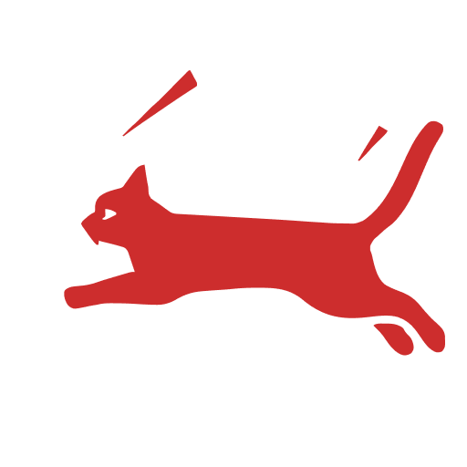

<p align="center">
  
<p>

# RED CAT PICTURES

<p align="center">
  <a href="https://redcatpictures.betteruptime.com">
    
  </a>
</p>


> Product Photographer in Kolkata | Indiaa

- 📦 SSR
- 🖼️ OG Tags
- 🚀 PWA
- ✋ Push Notification
- 🌙 Light/Dark Mode
- 🗂️ CMS (Notion)
- 🤖 Automation (Email, Whatsapp)
- 🐋 Containerized
- 🪄 CI/CD (Github Action)
- ⚡️ API Route Caching
- 📐 Analytics

- [ ] Whatsapp Automation

- [ ] Image Search
- [ ] Update Photo page with title and description
- [ ] Instagram Automation
- [ ] Modify Photo page to Project page
- [ ] Like/Dislike Count Content
- [ ] Add live streaming page
- [ ] Audio Dictation of Content
- [ ] Q&A Bot

## How to Deploy

1. Initialize Swarm on the Manager Node

```bash
docker swarm init --advertise-addr <MANAGER-IP>
```

2. Join Worker Nodes to the Swarm

```bash
docker swarm join --token <WORKER-TOKEN> <MANAGER-IP>:2377
```

3. Check Node Status

```bash
docker node ls
```

4. Create a docker volume

```bash
upload static, .data into /root/red-cat-pictures
```

5. Use Docker Stack to deploy multi-container application

```bash
docker stack deploy --compose-file docker-compose.prod.yml red-cat-pictures
```

6. Scale service

```bash
docker service scale red-cat-pictures_app=2
```

7. Verify

```bash
docker service ls
docker service ps red-cat-pictures_app
```

## License

Published under the [MIT](https://github.com/Algostract/red-cat-pictures/blob/main/LICENSE) license.
<br><br>
<a href="https://github.com/Algostract/red-cat-pictures/graphs/contributors">

</a>
